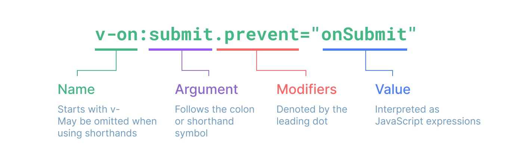

# Composants

<!-- Badge -->
<BadgeVueJunior class="badge-ctn" />

<br>

> 👓 Keep in mind : [Le système de composant](#système-de-composants)

<br>

Chaque fichier `.vue`, qui représente un composant, sera transformer en un ViewModel par Vue.js lors de l'instanciation de l'application.  
Use PascalCase tag names for child components.
## 📘 Read more

<a href="https://vuejs.org/guide/essentials/component-basics.html" target="_blank">Documentation officielle</a>

## Créer un composant

Avec Vue 3, nous avons 2 logique d'organiser et de créer nos composants :
- le Single-File Component
- Plusieurs templates dans un même fichier

### Composant monofichier (Single-File Component ou SFC)

Un peu déroutant au début, mais l'architecture SFC[^SFC] d'un fichier `.vue` se révèle être très 'handy'.
On retrouve notre CSS, HTML et JS dans un seul et même fichier qui décrit un composant de notre application et tout se passe dans le même fichier. Je trouve ça très bien.
L'avantage de la balise `<template>` est que Vue interprétera le JavaScript embarqué sous le HTML. C'est un mélange de HTML/JavaScript qui peut porter à confusion, mais si on le garde à l'esprit on s'en sort.


``` vue
<script setup>
// .. JavaScript here
</script>
<template>
<!-- .. HTML / JavaScript here -->
</template>
<style scoped>
/* .. CSS here */
</style>
```

L'attribut `setup` informe Vue qu'il devra gérer lui même l'export du composant.  
La balise `<template>` est obligatoire dans un fichier `.vue`.[^balise-template].  
L'attribut `scoped` informe Vue que le css n'impacte que les éléments du fichier dans lequel il réside.[^scoped]

### Directement en JavaScript
*Pour le moment je ne m'en préoccupe pas, je focus sur le SFC, à voir plus tard.*

## Style d'API

Avec la version 3, Vue JS offre une nouvelle façon d'écrire les composants : la Composition API.
Avant, il n'y avait qu'une seule manière de faire, elle a été renommé à l'occasion en : Options API.
La différence entre les deux réside dans la syntaxe de déclaration des datas accessible par la template, mais aussi dans le fait que la composition API est plus facile à maintenir.

Exemple de projet du bouton ajouter une valeur : 

### Options API
### Composition API
fonction set-up(), attribut setup
## Syntaxe de template

>[!NOTE]
> J'utilise la balise html pour les code snippet avec shiki mais c'est faux, c'est pas tout a fait que du html

### Text Interpolation

La syntaxe moustache, permet d'afficher de la data au format texte.

```html
<!-- Syntaxe 'Moustache' -->
<span>Message: {{ msg }}</span>
```
### Raw HTML : 

La syntaxe moustache possède quelques limitations et l'une d'entre elles et le fait qu'elle ne traite pas le HTML lors de l'affichage : 

```html
<p>Using text interpolation: {{ rawHtml }}</p>
<!-- Using text interpolation: <span style="color: red">This should be red.</span> -->

<p>Using v-html directive: <span v-html="rawHtml"></span></p>
<!-- Using v-html directive: This should be red. (le texte est écrit en rouge.) --> 
```
-> Liées à la page vers les directives.

### Liaisons d'attributs

Une seconde limitation de la syntaxe moustache est qu'elle ne peut pas être utiliser directement dans les attributs natives d'HTML : 
On utilisera une autre directive : `v-bind` 

```html
<!-- Si dynamicId est null ou undefined, Vue n'affichera pas l'attr. id -->
<div v-bind:id="dynamicId"></div>

<!-- Shorthand -->
<div :id="dynamicId"></div>

<!-- Same-name Shorthand. ex: :id="id"-->
<div :id></div>
<div v-bind:id></div>
```
> [!WARNING] Atribut booléen
> Si `isButtonDisabled` est un empty string, Vue affichera disabled="", et l'élément sera disabled tout de même.

```html
<button :disabled="isButtonDisabled">Button</button>
```

### Mutliple liaisons sur un élément

```js
const objectOfAttrs = {
  id: 'container',
  class: 'wrapper'
}
```
```html
<div v-bind="objectOfAttrs"></div>
```

### Utiliser du JavaScript

```html
{{ number + 1 }}

{{ ok ? 'YES' : 'NO' }}

{{ message.split('').reverse().join('') }}

<div :id="`list-${id}`"></div>
```

### Expression only
### Appel de méthode du composant dans le binding
### Setting .globalProperties depuis le config


### Directives

Prefixed avec -v



## Exporter, Importer & Utiliser un composant

Une fois que l'on a créé notre composant, lié la data et stylisé l'élément, il ne reste plus qu'à le rendre accessible aux différents éléments parents ou enfants qui en auronts besoin : 

```vue
<script setup>
import ExempleComposant from './ExampleComposant.vue'
</script>

<template>
  <ExempleComposant />
</template>
```
Avec la composition API Vue se charge d'effectuer l'`export default` pour nous, il nous suffit d'importer le composant.
It's also possible to globally register a component, making it available to all components in a given app without having to import it.

<details>
<summary> 📘 Read more : Javascript | Export & Import </summary>
https://javascript.info/import-export
</details>

### Props

Voir chapitre les Props

### In-DOM

On peut écrire des template Vue directement dans la balise native template d'HTML
https://developer.mozilla.org/en-US/docs/Web/HTML/Element/template

<!-- Footnotes -->
[^SFC]: https://vuejs.org/guide/scaling-up/sfc.html
[^balise-template]: 🗝️ `<template>` obligatoire.
[^scoped]: 🗝️ `scoped` : le css n'impacte que le composant.